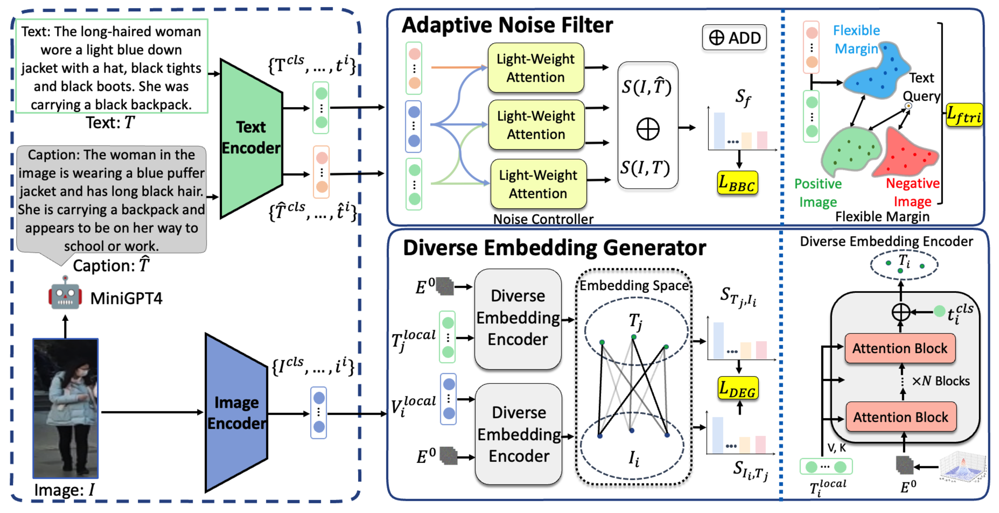
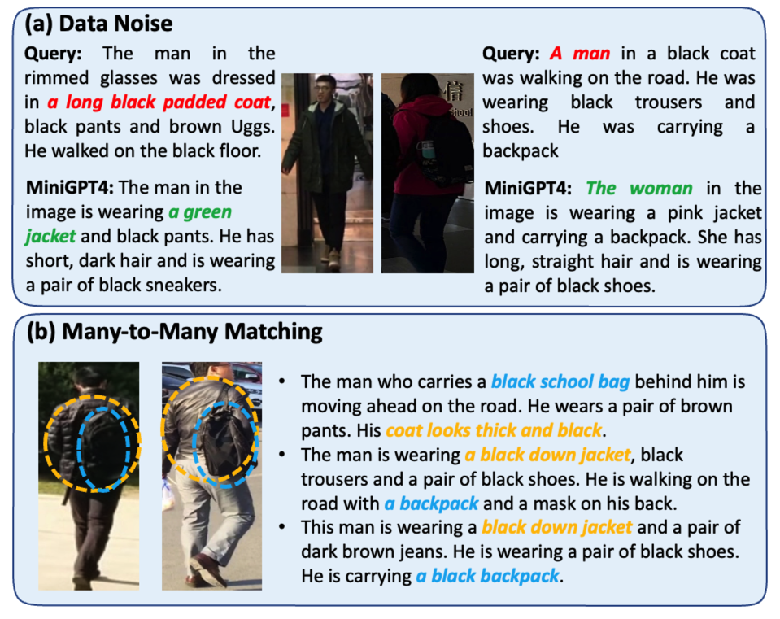
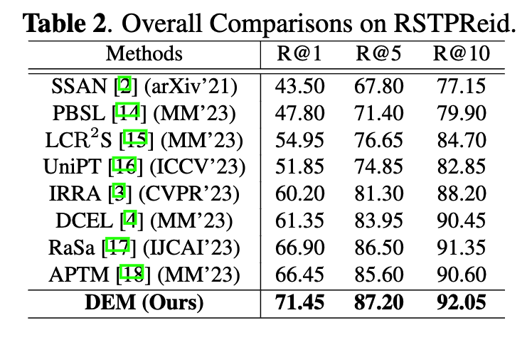
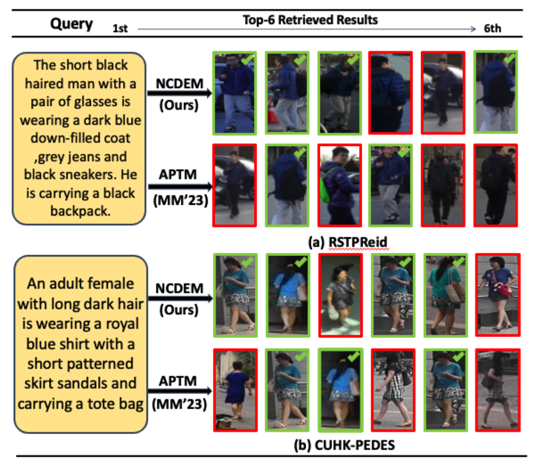

## Introduction
This is the source code of "Diverse Embedding Modeling with Adaptive Noise Filter for Text-based Person Retrieval"

## Diverse Embedding Modeling with Adaptive Noise Filter for Text-based Person Retrieval
The DEM model is structured with two integral components:

1) **Adaptive Noise Filter:** This component distinguish noisy data and adaptively adjust their weights during training.

2) **Diverse Embedding Generator:** Designed to generate diverse embeddings and thus perform cross-modal alignments to effectively simulate many-to-many matching scenario.



## Proposed Model (DEM)
* Adaptive Noise Filter
* Diverse Embedding Generator


## Motivation

* Illustrative examples of existing problems: (a) Data Noise, i.e., improper annotations of jacket color (left) and gender (right) (b) Many-to-Many Matching Relationships, i.e., a black top can be coupled with multiple heterogeneous captions.

## Results



## Retrieval Examples



## Usage
* Download the CUHK-PEDES dataset, ICFG-PEDES dataset and RSTPReid dataset.
* External Annotations for CUHK-PEDES are partly aviliable in `./data/cuhk_train.json`, full access will be aviliable soon.
* Training
```python
python3 run.py \
--task "itr_rstp" \
--dist "gpu0" \
--output_dir "your_output_path" \
--checkpoint "your_checkpoint_path.pth"
```
* Testing
```python
python3 run.py \
--task "itr_rstp" \
--dist "gpu0" \
--output_dir "your_output_path" \
--checkpoint "your_checkpoint_path.pth" \
--evaluate 